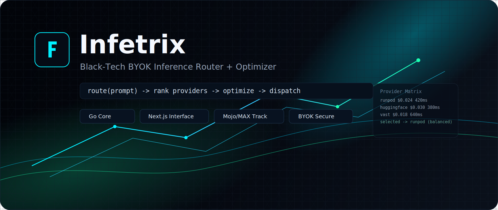
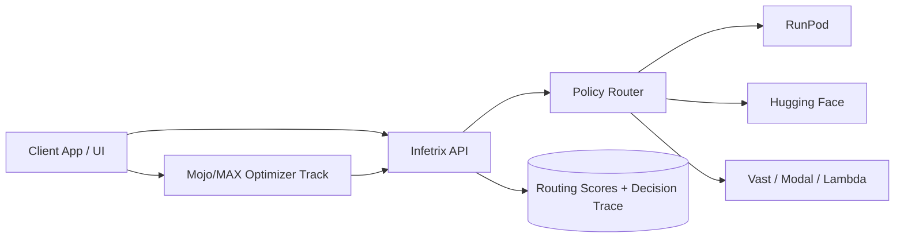

<p align="center">
  
</p>

<p align="center">
  <strong>Bring Your Own Key inference routing for teams that care about cost, latency, and control.</strong>
</p>

<p align="center">
  <a href="https://inferix-phi.vercel.app"></a>
  
  
  
</p>

<p align="center">
  <a href="#why-infetrix">Why</a> ·
  <a href="#core-features">Features</a> ·
  <a href="#architecture">Architecture</a> ·
  <a href="#run-local">Run Local</a> ·
  <a href="#security-posture">Security</a> ·
  <a href="#roadmap">Roadmap</a>
</p>

## Why Infetrix

Most teams overpay for inference because routing is static and optimization is disconnected from provider choice.

Infetrix solves that with one control plane:

- user-owned provider credentials (BYOK)
- policy-driven provider selection (`cost`, `latency`, `balanced`)
- optimizer track (Mojo/MAX) to reduce GPU-seconds per request
- transparent output showing why a provider was selected

Built as an open-source personal project in Vienna with a practical goal:
**make AI inference cheaper without making it slower.**

## Core Features

### Current

- Go API with endpoints:
  - `GET /health`
  - `POST /v1/route`
  - `POST /v1/infer`
- weighted provider ranking by price/latency/availability
- provider adapters:
  - `runpod`
  - `huggingface`
- Next.js + TypeScript UI with a direct 3-step workflow
- Vercel deployment for frontend

### In Progress

- provider expansion: Vast.ai, Modal, Lambda Labs
- Mojo/MAX optimization stage before dispatch
- benchmark-driven cost and latency reporting

## Architecture



## Project Layout

```text
Infetrix/
├── cmd/infetrix/            # Go entrypoint
├── internal/
│   ├── api/                 # HTTP handlers + validation
│   ├── config/              # Env-driven config
│   ├── provider/            # Provider adapters
│   ├── router/              # Ranking engine
│   └── security/            # Redaction helpers
├── frontend/                # Next.js + TypeScript
│   ├── app/v1/workloads/    # Workload-first API (create/list/execute/delete)
│   ├── db/schema.sql         # PostgreSQL schema
│   └── db/pgvector.sql       # Optional pgvector migration
├── docs/                    # Architecture + optimization docs
└── scripts/max/             # Mojo/MAX benchmark scripts
```

## Run Local

### Backend

```bash
go run ./cmd/infetrix
```

Optional env:

```bash
export INFETRIX_ADDR=":8080"
export INFETRIX_DEFAULT_POLICY="balanced"
```

### Frontend

```bash
cd frontend
npm install
cp .env.example .env.local
npm run dev
```

Open `http://localhost:3000`.

Workload persistence:
- Set `DATABASE_URL` in `frontend/.env.local` to enable PostgreSQL storage.
- Without `DATABASE_URL`, workloads fall back to in-memory storage.
- Optional pgvector setup: run `frontend/db/pgvector.sql` after `frontend/db/schema.sql`.

## Example Request

```bash
curl -s http://localhost:8080/v1/route \
  -H "Content-Type: application/json" \
  -d '{
    "prompt": "Summarize this text.",
    "model": "llama-3.1-8b-instruct",
    "policy": "balanced",
    "providers": [
      {
        "name": "runpod",
        "endpoint": "https://api.runpod.ai/v2/YOUR_ENDPOINT/runsync",
        "api_key": "rp_demo_key_123",
        "price_per_1k_tokens": 0.024,
        "avg_latency_ms": 420,
        "availability": 0.99
      },
      {
        "name": "huggingface",
        "endpoint": "https://api-inference.huggingface.co/models/meta-llama/Llama-3.1-8B-Instruct",
        "api_key": "hf_demo_key_456",
        "price_per_1k_tokens": 0.030,
        "avg_latency_ms": 380,
        "availability": 0.98
      }
    ]
  }' | jq
```

## Security Posture

- no hardcoded real provider keys in source
- `.env*` and local secret files are gitignored
- key exposure is reduced to preview format (`abc...12`)
- infer dispatch validates provider endpoint host and protocol
- API body size limits and HTTP server timeouts are enabled

For production hardening, next items are auth, rate limits, and audited key storage.

## Mojo/MAX Path

Playbook: `docs/optimization/mojo-max-playbook.md`

```bash
./scripts/max/run_baseline.sh <model_path> artifacts/baseline.json
./scripts/max/run_tuned.sh <tuned_model_path> artifacts/tuned.json
./scripts/max/compare.py artifacts/baseline.json artifacts/tuned.json
```

## Roadmap

1. Add remaining provider adapters (Vast, Modal, Lambda).
2. Integrate Mojo-based optimization before dispatch.
3. Publish reproducible benchmark matrix (cost, TTFT, throughput).
4. Add authenticated multi-project API mode.

## License

Licensed under the MIT License. See [LICENSE](LICENSE).
